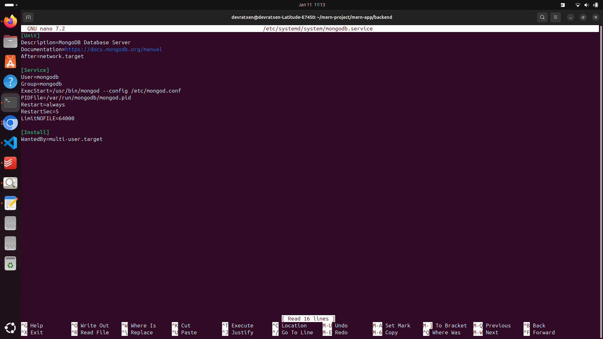
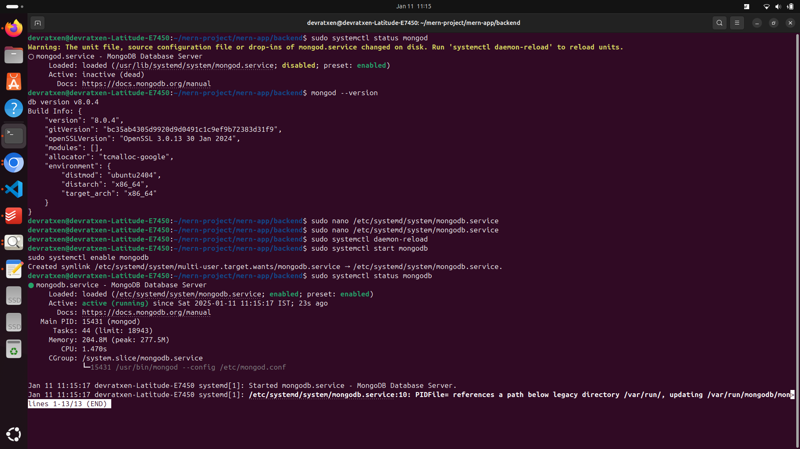

# React + Vite

twilio :: NKYUFD9G4CVCAMWZYFZ2DDUC
accountsid : AC4a2f35fa4d9996f6e808c153a0a2392b
auth token : 950937d5c15fcfa787650d2e73a15e3f

This template provides a minimal setup to get React working in Vite with HMR and some ESLint rules.

Currently, two official plugins are available:

- [@vitejs/plugin-react](https://github.com/vitejs/vite-plugin-react/blob/main/packages/plugin-react/README.md) uses [Babel](https://babeljs.io/) for Fast Refresh
- [@vitejs/plugin-react-swc](https://github.com/vitejs/vite-plugin-react-swc) uses [SWC](https://swc.rs/) for Fast Refresh

===

# Changing the network

1. Upon changing the network, you can see how the ip got changed as this server is not configured for static ip..

```bash
devratxen@devratxen-Latitude-E7450:~$ curl -4 ifconfig.me
106.219.229.74devratxen@devratxen-Latitude-E7450:~$ curl -4 ifconfig.me
152.59.68.238devratxen@devratxen-Latitude-E7450:~$ ^C
```

# ngrok configuration

1. ngrok setup is at the below link

https://dashboard.ngrok.com/get-started/setup/linux?domainId=rd_2rP50JBEqRjH6gTw4X1wDFmVdnJ

go to the folder like backend or project folder and then run the below command

```bash
ngrok http --url=reliably-moving-dog.ngrok-free.app 5000
```

after running it will look as below --

ngrok (Ctrl+C to quit)

❤️ ngrok? We're hiring https://ngrok.com/careers

Session Status online  
Account sunitaratxen@gmail.com (Plan: Free)  
Version 3.19.0  
Region India (in)  
Latency 444ms  
Web Interface http://127.0.0.1:4040  
Forwarding https://reliably-moving-dog.ngrok-free.app -> http://localhost:5000

Connections ttl opn rt1 rt5 p50 p90  
 0 0 0.00 0.00 0.00 0.00

- 5000 can be replaced by your port number where the backend is running
- this is for static url .
- if there is dynamic url then you can run directly the below :

```bash
ngrok http http://localhost:5000
```

2. the same thing can be achieved for the frontend if it is running on different port

# how to kill a port in node js if already in use

1. devratxen@devratxen-Latitude-E7450:~/mern-project/mern-app/backend$ sudo lsof -i :5000
   [sudo] password for devratxen:
   COMMAND PID USER FD TYPE DEVICE SIZE/OFF NODE NAME
   node\x20/ 1749 devratxen 23u IPv6 15793 0t0 TCP \*:5000 (LISTEN)
   devratxen@devratxen-Latitude-E7450:~/mern-project/mern-app/backend$ kill -9 1749

# how to kill and delete a pm2 activity

devratxen@devratxen-Latitude-E7450:~/mern-project/mern-app/backend$ pm2 list
┌────┬─────────────────┬─────────────┬─────────┬─────────┬──────────┬────────┬──────┬───────────┬──────────┬──────────┬──────────┬──────────┐
│ id │ name │ namespace │ version │ mode │ pid │ uptime │ ↺ │ status │ cpu │ mem │ user │ watching │
├────┼─────────────────┼─────────────┼─────────┼─────────┼──────────┼────────┼──────┼───────────┼──────────┼──────────┼──────────┼──────────┤
│ 0 │ mern-backend │ default │ N/A │ fork │ N/A │ 8m │ 2 │ online │ 0% │ 0b │ dev… │ disabled │
└────┴─────────────────┴─────────────┴─────────┴─────────┴──────────┴────────┴──────┴───────────┴──────────┴──────────┴──────────┴──────────┘
devratxen@devratxen-Latitude-E7450:~/mern-project/mern-app/backend$ pm2 stop mern-backend
[PM2] Applying action stopProcessId on app [mern-backend](ids: [ 0 ])
[PM2] [mern-backend](0) ✓
┌────┬─────────────────┬─────────────┬─────────┬─────────┬──────────┬────────┬──────┬───────────┬──────────┬──────────┬──────────┬──────────┐
│ id │ name │ namespace │ version │ mode │ pid │ uptime │ ↺ │ status │ cpu │ mem │ user │ watching │
├────┼─────────────────┼─────────────┼─────────┼─────────┼──────────┼────────┼──────┼───────────┼──────────┼──────────┼──────────┼──────────┤
│ 0 │ mern-backend │ default │ N/A │ fork │ N/A │ 0 │ 2 │ stopped │ 0% │ 0b │ dev… │ disabled │
└────┴─────────────────┴─────────────┴─────────┴─────────┴──────────┴────────┴──────┴───────────┴──────────┴──────────┴──────────┴──────────┘
devratxen@devratxen-Latitude-E7450:~/mern-project/mern-app/backend$ pm2 delete mern-backend
[PM2] Applying action deleteProcessId on app [mern-backend](ids: [ 0 ])
[PM2] [mern-backend](0) ✓
┌────┬───────────┬─────────────┬─────────┬─────────┬──────────┬────────┬──────┬───────────┬──────────┬──────────┬──────────┬──────────┐
│ id │ name │ namespace │ version │ mode │ pid │ uptime │ ↺ │ status │ cpu │ mem │ user │ watching │
└────┴───────────┴─────────────┴─────────┴─────────┴──────────┴────────┴──────┴───────────┴──────────┴──────────┴──────────┴──────────┘
[PM2][WARN] Current process list is not synchronized with saved list. App mern-backend differs. Type 'pm2 save' to synchronize.
devratxen@devratxen-Latitude-E7450:~/mern-project/mern-app/backend$ pm2 list
┌────┬───────────┬─────────────┬─────────┬─────────┬──────────┬────────┬──────┬───────────┬──────────┬──────────┬──────────┬──────────┐
│ id │ name │ namespace │ version │ mode │ pid │ uptime │ ↺ │ status │ cpu │ mem │ user │ watching │
└────┴───────────┴─────────────┴─────────┴─────────┴──────────┴────────┴──────┴───────────┴──────────┴──────────┴──────────┴──────────┘
[PM2][WARN] Current process list is not synchronized with saved list. App mern-backend differs. Type 'pm2 save' to synchronize.
devratxen@devratxen-Latitude-E7450:~/mern-project/mern-app/backend$

# how to start a new pm2

devratxen@devratxen-Latitude-E7450:~/mern-project/mern-app/backend$ pm2 start server.js --name mern-app
[PM2] Starting /home/devratxen/mern-project/mern-app/backend/server.js in fork_mode (1 instance)
[PM2] Done.
┌────┬─────────────┬─────────────┬─────────┬─────────┬──────────┬────────┬──────┬───────────┬──────────┬──────────┬──────────┬──────────┐
│ id │ name │ namespace │ version │ mode │ pid │ uptime │ ↺ │ status │ cpu │ mem │ user │ watching │
├────┼─────────────┼─────────────┼─────────┼─────────┼──────────┼────────┼──────┼───────────┼──────────┼──────────┼──────────┼──────────┤
│ 0 │ mern-app │ default │ 1.0.0 │ fork │ 11348 │ 0s │ 0 │ online │ 0% │ 20.8mb │ dev… │ disabled │
└────┴─────────────┴─────────────┴─────────┴─────────┴──────────┴────────┴──────┴───────────┴──────────┴──────────┴──────────┴──────────┘
[PM2][WARN] Current process list is not synchronized with saved list. App mern-backend differs. Type 'pm2 save' to synchronize.
devratxen@devratxen-Latitude-E7450:~/mern-project/mern-app/backend$ pm2 save
[PM2] Saving current process list...
[PM2] Successfully saved in /home/devratxen/.pm2/dump.pm2
devratxen@devratxen-Latitude-E7450:~/mern-project/mern-app/backend$

# make the pm2 as system start up process

devratxen@devratxen-Latitude-E7450:~/mern-project/mern-app/backend$ pm2 list
┌────┬─────────────┬─────────────┬─────────┬─────────┬──────────┬────────┬──────┬───────────┬──────────┬──────────┬──────────┬──────────┐
│ id │ name │ namespace │ version │ mode │ pid │ uptime │ ↺ │ status │ cpu │ mem │ user │ watching │
├────┼─────────────┼─────────────┼─────────┼─────────┼──────────┼────────┼──────┼───────────┼──────────┼──────────┼──────────┼──────────┤
│ 0 │ mern-app │ default │ 1.0.0 │ fork │ 11348 │ 2m │ 0 │ online │ 0% │ 77.4mb │ dev… │ disabled │
└────┴─────────────┴─────────────┴─────────┴─────────┴──────────┴────────┴──────┴───────────┴──────────┴──────────┴──────────┴──────────┘
devratxen@devratxen-Latitude-E7450:~/mern-project/mern-app/backend$ pm2 startup
[PM2] Init System found: systemd
[PM2] To setup the Startup Script, copy/paste the following command:
sudo env PATH=$PATH:/usr/bin /usr/lib/node_modules/pm2/bin/pm2 startup systemd -u devratxen --hp /home/devratxen
devratxen@devratxen-Latitude-E7450:~/mern-project/mern-app/backend$ sudo env PATH=$PATH:/usr/bin /usr/lib/node_modules/pm2/bin/pm2 startup systemd -u devratxen --hp /home/devratxen
[sudo] password for devratxen:
[PM2] Init System found: systemd
Platform systemd
Template
[Unit]
Description=PM2 process manager
Documentation=https://pm2.keymetrics.io/
After=network.target

[Service]
Type=forking
User=devratxen
LimitNOFILE=infinity
LimitNPROC=infinity
LimitCORE=infinity
Environment=PATH=/usr/local/sbin:/usr/local/bin:/usr/sbin:/usr/bin:/sbin:/bin:/usr/games:/usr/local/games:/snap/bin:/snap/bin:/usr/bin:/bin:/usr/local/sbin:/usr/local/bin:/usr/sbin:/usr/bin
Environment=PM2_HOME=/home/devratxen/.pm2
PIDFile=/home/devratxen/.pm2/pm2.pid
Restart=on-failure

ExecStart=/usr/lib/node_modules/pm2/bin/pm2 resurrect
ExecReload=/usr/lib/node_modules/pm2/bin/pm2 reload all
ExecStop=/usr/lib/node_modules/pm2/bin/pm2 kill

[Install]
WantedBy=multi-user.target

Target path
/etc/systemd/system/pm2-devratxen.service
Command list
[ 'systemctl enable pm2-devratxen' ]
[PM2] Writing init configuration in /etc/systemd/system/pm2-devratxen.service
[PM2] Making script booting at startup...
[PM2] [-] Executing: systemctl enable pm2-devratxen...
[PM2] [v] Command successfully executed.
+---------------------------------------+
[PM2] Freeze a process list on reboot via:
$ pm2 save

[PM2] Remove init script via:
$ pm2 unstartup systemd
devratxen@devratxen-Latitude-E7450:~/mern-project/mern-app/backend$ pm2 save
[PM2] Saving current process list...
[PM2] Successfully saved in /home/devratxen/.pm2/dump.pm2
devratxen@devratxen-Latitude-E7450:~/mern-project/mern-app/backend$

and check the server at 5000 port if running or not


# how to log the pm2

```bash
pm2 list 
pm2 logs --lines 100 muushakaH-mern-app
```
devratxen@devratxen-Latitude-E7450:~/mern-project/mern-app/backend$ pm2 logs mern-app
[TAILING] Tailing last 15 lines for [mern-app] process (change the value with --lines option)
/home/devratxen/.pm2/logs/mern-app-out.log last 15 lines:
0|mern-app | reason: TopologyDescription {
0|mern-app | type: 'Unknown',
0|mern-app | servers: Map(1) { 'localhost:27017' => [ServerDescription] },
0|mern-app | stale: false,
0|mern-app | compatible: true,
0|mern-app | heartbeatFrequencyMS: 10000,
0|mern-app | localThresholdMS: 15,
0|mern-app | setName: null,
0|mern-app | maxElectionId: null,
0|mern-app | maxSetVersion: null,
0|mern-app | commonWireVersion: 0,
0|mern-app | logicalSessionTimeoutMinutes: null
0|mern-app | },
0|mern-app | code: undefined
0|mern-app | }

/home/devratxen/.pm2/logs/mern-app-error.log last 15 lines:
0|mern-app | at Server.listen (node:net:2099:7)
0|mern-app | at Function.listen (/home/devratxen/mern-app/backend/node_modules/express/lib/application.js:635:24)
0|mern-app | at Object.<anonymous> (/home/devratxen/mern-app/backend/server.js:41:5)
0|mern-app | at Module.\_compile (node:internal/modules/cjs/loader:1562:14)
0|mern-app | at Object..js (node:internal/modules/cjs/loader:1699:10)
0|mern-app | at Module.load (node:internal/modules/cjs/loader:1313:32)
0|mern-app | at Function.\_load (node:internal/modules/cjs/loader:1123:12)
0|mern-app | at Object.<anonymous> (/usr/lib/node_modules/pm2/lib/ProcessContainerFork.js:33:23) {
0|mern-app | code: 'EADDRINUSE',
0|mern-app | errno: -98,
0|mern-app | syscall: 'listen',
0|mern-app | address: '::',
0|mern-app | port: 5000
0|mern-app | }
0|mern-app | Operation `tests.find()` buffering timed out after 10000ms

# how to set up the mongo db and start it automatically

https://www.mongodb.com/docs/manual/tutorial/install-mongodb-on-ubuntu/

devratxen@devratxen-Latitude-E7450:~/mern-project/mern-app/backend$ sudo systemctl status mongod
Warning: The unit file, source configuration file or drop-ins of mongod.service changed on disk. Run 'systemctl daemon-reload' to reload units.
○ mongod.service - MongoDB Database Server
Loaded: loaded (/usr/lib/systemd/system/mongod.service; disabled; preset: enabled)
Active: inactive (dead)
Docs: https://docs.mongodb.org/manual
devratxen@devratxen-Latitude-E7450:~/mern-project/mern-app/backend$

[Unit]
Description=MongoDB Database Server
Documentation=https://docs.mongodb.org/manual
After=network.target

[Service]
User=mongodb
Group=mongodb
ExecStart=/usr/bin/mongod --config /etc/mongod.conf
PIDFile=/var/run/mongodb/mongod.pid
Restart=always
RestartSec=5
LimitNOFILE=64000

[Install]
WantedBy=multi-user.target



devratxen@devratxen-Latitude-E7450:~/mern-project/mern-app/backend$ sudo systemctl status mongod
Warning: The unit file, source configuration file or drop-ins of mongod.service changed on disk. Run 'systemctl daemon-reload' to reload units.
○ mongod.service - MongoDB Database Server
Loaded: loaded (/usr/lib/systemd/system/mongod.service; disabled; preset: enabled)
Active: inactive (dead)
Docs: https://docs.mongodb.org/manual
devratxen@devratxen-Latitude-E7450:~/mern-project/mern-app/backend$ mongod --version
db version v8.0.4
Build Info: {
"version": "8.0.4",
"gitVersion": "bc35ab4305d9920d9d0491c1c9ef9b72383d31f9",
"openSSLVersion": "OpenSSL 3.0.13 30 Jan 2024",
"modules": [],
"allocator": "tcmalloc-google",
"environment": {
"distmod": "ubuntu2404",
"distarch": "x86_64",
"target_arch": "x86_64"
}
}
devratxen@devratxen-Latitude-E7450:~/mern-project/mern-app/backend$ sudo nano /etc/systemd/system/mongodb.service
devratxen@devratxen-Latitude-E7450:~/mern-project/mern-app/backend$ sudo nano /etc/systemd/system/mongodb.service
devratxen@devratxen-Latitude-E7450:~/mern-project/mern-app/backend$ sudo systemctl daemon-reload
devratxen@devratxen-Latitude-E7450:~/mern-project/mern-app/backend$ sudo systemctl start mongodb
sudo systemctl enable mongodb
Created symlink /etc/systemd/system/multi-user.target.wants/mongodb.service → /etc/systemd/system/mongodb.service.
devratxen@devratxen-Latitude-E7450:~/mern-project/mern-app/backend$ sudo systemctl status mongodb
● mongodb.service - MongoDB Database Server
Loaded: loaded (/etc/systemd/system/mongodb.service; enabled; preset: enabled)
Active: active (running) since Sat 2025-01-11 11:15:17 IST; 23s ago
Docs: https://docs.mongodb.org/manual
Main PID: 15431 (mongod)
Tasks: 44 (limit: 18943)
Memory: 204.8M (peak: 277.5M)
CPU: 1.470s
CGroup: /system.slice/mongodb.service
└─15431 /usr/bin/mongod --config /etc/mongod.conf

Jan 11 11:15:17 devratxen-Latitude-E7450 systemd[1]: Started mongodb.service - MongoDB Database Server.
Jan 11 11:15:17 devratxen-Latitude-E7450 systemd[1]: /etc/systemd/system/mongodb.service:10: PIDFile= references a path below legacy directory /var/run/, updating /var/run/mongodb/mon>
lines 1-13/13 (END)



and full writing --

B. Configure MongoDB as a systemd Service
Create a systemd Service File for MongoDB:

bash
Copy code
sudo nano /etc/systemd/system/mongodb.service
Add the Following Configuration:

ini
Copy code
[Unit]
Description=MongoDB Database Server
Documentation=https://docs.mongodb.org/manual
After=network.target

[Service]
User=mongodb
Group=mongodb
ExecStart=/usr/bin/mongod --config /etc/mongod.conf
PIDFile=/var/run/mongodb/mongod.pid
Restart=always
RestartSec=5
LimitNOFILE=64000

[Install]
WantedBy=multi-user.target
Notes:

User and Group: Ensure that the User and Group match the ones used during MongoDB installation. Commonly, it's mongodb.
ExecStart: Points to the MongoDB executable and configuration file.
Reload systemd Daemon to Acknowledge the New Service:

bash
Copy code
sudo systemctl daemon-reload
Start and Enable MongoDB Service:

bash
Copy code
sudo systemctl start mongodb
sudo systemctl enable mongodb
Explanation:

start: Initiates the MongoDB service immediately.
enable: Configures MongoDB to start automatically on system boot.
Verify MongoDB Service Status:

bash
Copy code
sudo systemctl status mongodb
Expected Output:

yaml
Copy code
● mongodb.service - MongoDB Database Server
Loaded: loaded (/etc/systemd/system/mongodb.service; enabled; vendor preset: enabled)
Active: active (running) since Fri 2025-01-10 18:30:00 IST; 10s ago
...
Troubleshooting:

Logs: If the service isn't active, check logs for errors.
bash
Copy code
sudo journalctl -u mongodb
Common Issues: Port conflicts, incorrect file permissions, or misconfigurations in /etc/mongod.conf.

Thought for 4 seconds
Understood. Ensuring that MongoDB starts automatically before your application begins is crucial for maintaining the stability and reliability of your MERN stack application. Below, I'll guide you through configuring MongoDB to start automatically on system boot and ensure that it starts before your application during deployments. This setup will prevent issues where your application fails to connect to MongoDB because the database service isn't running.

1. Configuring MongoDB to Start Automatically on System Boot
   The most reliable way to ensure MongoDB starts automatically is by configuring it as a systemd service. This method manages the MongoDB service, ensuring it starts on boot and restarts if it crashes.

A. Verify MongoDB Installation
First, ensure that MongoDB is installed correctly on your server.

Check MongoDB Version:

bash
Copy code
mongod --version
Expected Output:

yaml
Copy code
db version v4.4.6
git version: <commit-hash>
OpenSSL version: OpenSSL 1.1.1f 31 Mar 2020
allocator: tcmalloc
modules: none
build environment:
distarch: x86_64
target_arch: x86_64
If MongoDB is Not Installed:

Install MongoDB following the official installation guide for your operating system. Here's a brief overview for Ubuntu:

bash
Copy code

# Import the public key used by the package management system

wget -qO - https://www.mongodb.org/static/pgp/server-4.4.asc | sudo apt-key add -

# Create a list file for MongoDB

echo "deb [ arch=amd64,arm64 ] https://repo.mongodb.org/apt/ubuntu focal/mongodb-org/4.4 multiverse" | sudo tee /etc/apt/sources.list.d/mongodb-org-4.4.list

# Reload local package database

sudo apt-get update

# Install MongoDB packages

sudo apt-get install -y mongodb-org
B. Configure MongoDB as a systemd Service
Create a systemd Service File for MongoDB:

bash
Copy code
sudo nano /etc/systemd/system/mongodb.service
Add the Following Configuration:

ini
Copy code
[Unit]
Description=MongoDB Database Server
Documentation=https://docs.mongodb.org/manual
After=network.target

[Service]
User=mongodb
Group=mongodb
ExecStart=/usr/bin/mongod --config /etc/mongod.conf
PIDFile=/var/run/mongodb/mongod.pid
Restart=always
RestartSec=5
LimitNOFILE=64000

[Install]
WantedBy=multi-user.target
Notes:

User and Group: Ensure that the User and Group match the ones used during MongoDB installation. Commonly, it's mongodb.
ExecStart: Points to the MongoDB executable and configuration file.
Reload systemd Daemon to Acknowledge the New Service:

bash
Copy code
sudo systemctl daemon-reload
Start and Enable MongoDB Service:

bash
Copy code
sudo systemctl start mongodb
sudo systemctl enable mongodb
Explanation:

start: Initiates the MongoDB service immediately.
enable: Configures MongoDB to start automatically on system boot.
Verify MongoDB Service Status:

bash
Copy code
sudo systemctl status mongodb
Expected Output:

yaml
Copy code
● mongodb.service - MongoDB Database Server
Loaded: loaded (/etc/systemd/system/mongodb.service; enabled; vendor preset: enabled)
Active: active (running) since Fri 2025-01-10 18:30:00 IST; 10s ago
...
Troubleshooting:

Logs: If the service isn't active, check logs for errors.
bash
Copy code
sudo journalctl -u mongodb
Common Issues: Port conflicts, incorrect file permissions, or misconfigurations in /etc/mongod.conf.
C. Ensure MongoDB Starts on Reboot
To confirm that MongoDB starts automatically on system reboot:

Reboot the Server:

bash
Copy code
sudo reboot
After Reboot, Check MongoDB Status:

bash
Copy code
sudo systemctl status mongodb
Expected Output: MongoDB service should be active (running).

====
now check the mongo after restart

devratxen@devratxen-Latitude-E7450:~/mern-project/mern-app/backend$ systemctl is-active --quiet mongod
devratxen@devratxen-Latitude-E7450:~/mern-project/mern-app/backend$ sudo systemctl status mongodb
● mongodb.service - MongoDB Database Server
Loaded: loaded (/etc/systemd/system/mongodb.service; enabled; preset: enabled)
Active: active (running) since Sat 2025-01-11 11:19:11 IST; 13min ago
Docs: https://docs.mongodb.org/manual
Main PID: 1470 (mongod)
Tasks: 46 (limit: 18943)
Memory: 289.9M (peak: 364.2M)
CPU: 10.188s
CGroup: /system.slice/mongodb.service
└─1470 /usr/bin/mongod --config /etc/mongod.conf

Jan 11 11:19:11 devratxen-Latitude-E7450 systemd[1]: Started mongodb.service - MongoDB Database Server.
devratxen@devratxen-Latitude-E7450:~/mern-project/mern-app/backend$

set up the deploy.sh changes

#!/bin/bash

# deploy.sh

# Define the log file for deployment

LOG_FILE="$HOME/mern-project/mern-app/deploy.log"

{
echo "----------------------------------------"
echo "Deployment started at $(date)"

    # Navigate to the client directory
    cd client || { echo "Client directory not found"; exit 1; }

    # Install client dependencies
    echo "Installing client dependencies..."
    npm install

    # Build the client
    echo "Building the client..."
    npm run build

    # Navigate back to the project root
    cd ..

    # Navigate to the backend directory
    cd backend || { echo "Backend directory not found"; exit 1; }

    # Install backend dependencies
    echo "Installing backend dependencies..."
    npm install

    # new line start @11Jan2025 by Kunal
    # Wait for MongoDB to be available using mongosh or port check
    echo "Checking MongoDB connection..."
    if ! command -v mongosh &> /dev/null
    then
        echo "mongosh not found, falling back to port check..."
    until nc -z localhost 27017
        do
            echo "Waiting for MongoDB to start..."
            sleep 5
        done
    else
        until mongosh --eval "print('waited for connection')" --quiet
        do
            echo "Waiting for MongoDB to start..."
            sleep 5
        done
    fi
    # new line end @11Jan2025 by Kunal

    # Ensure PM2 is installed globally
    if ! command -v pm2 &> /dev/null
    then
        echo "PM2 not found, installing PM2..."
        npm install -g pm2
    fi

    # Start or Restart the server with PM2
    echo "Starting/Restarting the server with PM2..."
    pm2 restart mern-app || pm2 start server.js --name mern-app

    echo "Deployment completed at $(date)"

} >> "$LOG_FILE" 2>&1

# how to clear the terminal

```bash
clear
```

# ssh configuration

## how to push from local other laptop like dell5410 to dell latitude

PS D:\NEXTARRATXEN\muushakaH> cd muushakaH-mern-kp3

PS D:\NEXTARRATXEN\muushakaH\muushakaH-mern-kp3> git init
Initialized empty Git repository in D:/NEXTARRATXEN/muushakaH/muushakaH-mern-kp3/.git/
PS D:\NEXTARRATXEN\muushakaH\muushakaH-mern-kp3> git remote add deploy ssh://devratxen@192.168.1.17/home/devratxen/muushakaH/mern-app/.git
PS D:\NEXTARRATXEN\muushakaH\muushakaH-mern-kp3> git fetch deploy
remote: Enumerating objects: 2146, done.
remote: Counting objects: 100% (2146/2146), done.
remote: Compressing objects: 100% (2050/2050), done.
remote: Total 2146 (delta 236), reused 0 (delta 0), pack-reused 0
Receiving objects: 100% (2146/2146), 3.75 MiB | 4.72 MiB/s, done.
Resolving deltas: 100% (236/236), done.
From ssh://192.168.1.17/home/devratxen/muushakaH/mern-app/

- [new branch] master -> deploy/master
  PS D:\NEXTARRATXEN\muushakaH\muushakaH-mern-kp3>

```bash
git branch -m master
git add .
git commit -m "Commit comments"
```

first time it may be required .

```bash
git push deploy master --force
```
